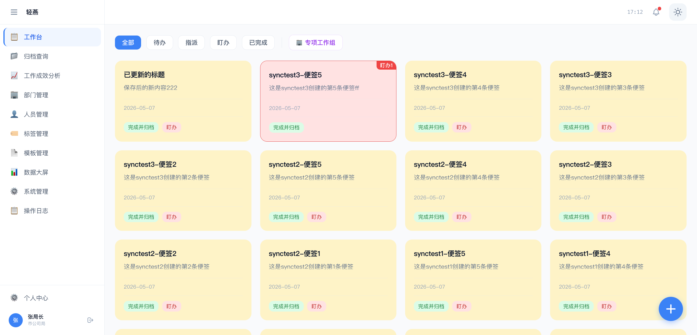
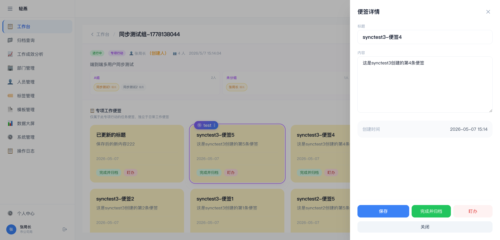
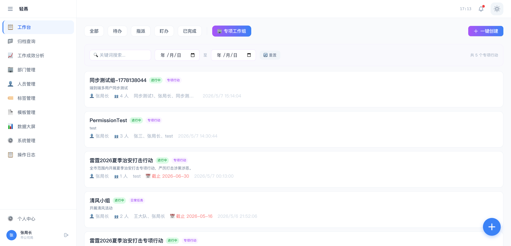
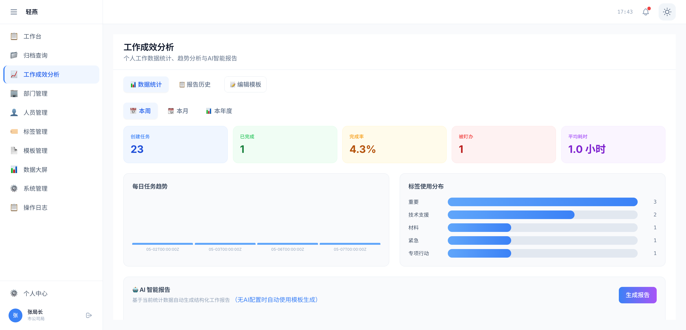
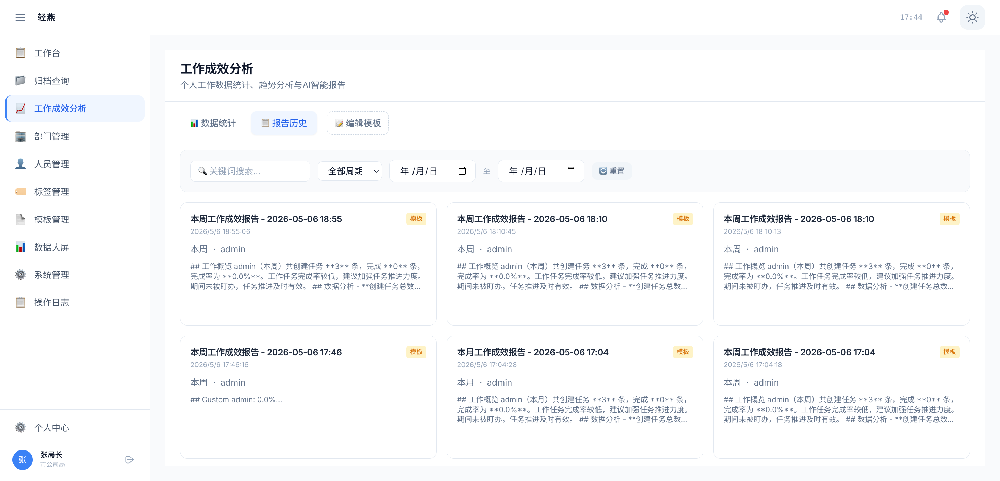
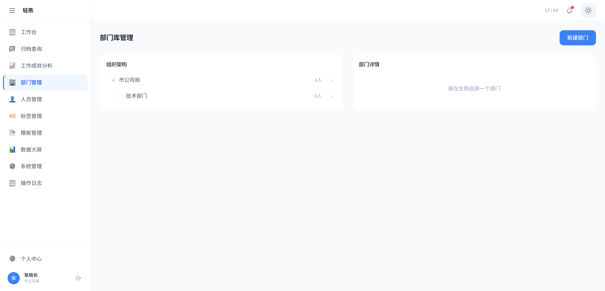
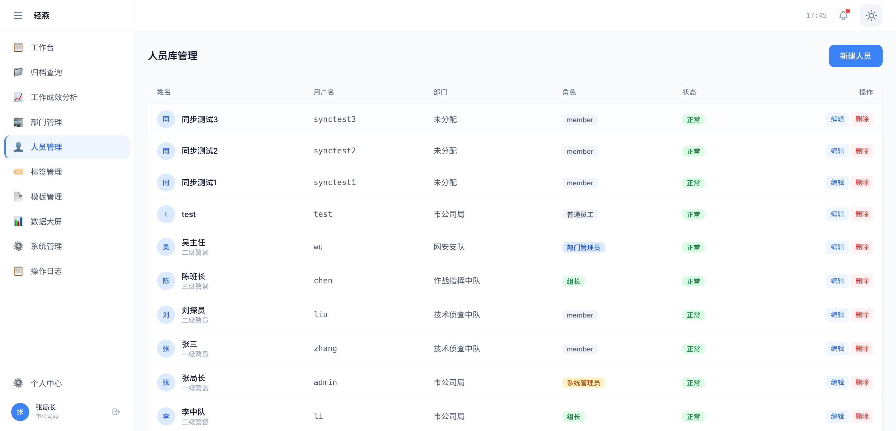
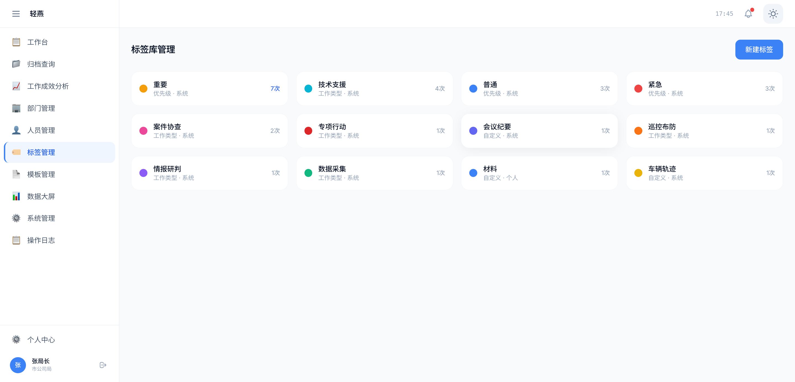

# 轻燕工作台 (Zephyr)

> 轻量化情指行一体化支撑解决方案

## 项目概述

**轻燕工作台** 是一款专为公司系统设计的轻量化情指行一体化支撑解决方案，以"电脑桌面任务"为唯一统一入口，承载被动接单、主动记工、即时协同全场景。系统包含桌面端（WinUI 3）、Web管理端（Vue 3）和大屏端，实现任务接收、工作记录、协同反馈、盯办预警的极致轻量化体验。

### 核心理念

- **无感嵌入办公环境**：以桌面悬浮任务为载体，不改变员工原有电脑操作习惯
- **多端协同**：桌面端、Web端、大屏端数据实时同步
- **极简交互**：纯白为底、极简为形、高级交互为魂，打造零学习成本的办公新体验

## 核心功能

### 1. 智能任务管理

- **多色状态管理**：黄色待办、绿色完成、红色盯办
- **任务生命周期**：创建 → 编辑 → 完成 → 归档 → 追溯
- **标签系统**：支持自定义标签分类管理
- **模板配置**：预设工作模板，提升效率



### 2. 协同办公

- **即时协同**：多人同屏画布协作
- **专项工作组**：构建工作小组，内置分工协作
- **组预设**：保存常用人员组合为预设模板，新建工作组时可一键选用
- **任务分配与跟踪**：扁平化任务管理，实时跟踪进度
- **智能推荐**：按工作类型一键推荐最佳参与人员，基于历史参与数据智能排序
- **盯办预警**：自动盯办机制，确保任务按时完成









### 3. 组织管理

- **部门架构**：树形组织架构管理
- **人员管理**：角色权限精细化控制，支持人员岗位、技能特长标签管理
- **人员档案**：自动统计参与过的工作类型及次数，可视化展示人员能力图谱
- **权限矩阵**：基于角色的数据权限与操作权限







### 4. 数据追溯

- **台账系统**：完整工作轨迹记录
- **归档查询**：按标签/时间/人员多维度检索
- **文号生成**：自动生成标准文号
- **报告导出**：支持Word/Excel格式导出

## 技术栈详情

### 桌面端 (WinUI 3)

- **UI框架**: WinUI 3 (Windows App SDK)
- **语言**: C# 11 / .NET 8
- **架构**: MVVM (CommunityToolkit.Mvvm)
- **数据库**: SQLite (Entity Framework Core)
- **通信**: Socket.io-client / WebSocket
- **系统集成**: Windows原生通知、托盘集成

### Web前端 (Vue 3)

- **框架**: Vue 3 (Composition API)
- **UI组件库**: DaisyUI + Tailwind CSS
- **状态管理**: Pinia
- **路由**: Vue Router 4
- **HTTP客户端**: Axios
- **实时通信**: Socket.io-client
- **构建工具**: Vite

### 服务端 (Go)

- **语言/框架**: Go 1.22 + Gin
- **ORM**: Gorm v2
- **数据库**: PostgreSQL 15+ (JSONB支持)
- **缓存**: Redis
- **认证**: JWT (RS256)
- **权限**: Casbin / 自研RBAC
- **实时通信**: Socket.io / Gorilla WebSocket

## 环境要求

### 桌面端

- **操作系统**: Windows 10/11 (Build 19041+)
- **运行时**: .NET 8 Runtime
- **内存**: 4GB RAM (推荐8GB)
- **存储**: 500MB 可用空间

### Web前端

- **Node.js**: 18.x 或更高版本
- **包管理器**: npm 8.x 或 yarn 1.x
- **浏览器**: Chrome 90+, Firefox 88+, Safari 15+, Edge 90+

### 服务端

- **操作系统**: Linux/macOS/Windows
- **Go**: 1.22 或更高版本
- **数据库**: PostgreSQL 15+
- **缓存**: Redis 6+
- **内存**: 2GB RAM (推荐4GB)

## 安装与配置

### 服务端部署

1. **克隆项目**

```bash
git clone https://github.com/kaptree/Zephyr.git
cd Zephyr/Server-code
```

2. **安装依赖**

```bash
go mod tidy
```

3. **配置数据库**

```bash
# 修改 config.json 中的数据库连接信息
{
  "database": {
    "host": "your-postgres-host",
    "port": 5432,
    "user": "postgres",
    "password": "your-password",
    "dbname": "labelpro"
  }
}
```

4. **生成JWT密钥**

```bash
# 在 Server-code/keys 目录下生成密钥对
openssl genrsa -out private.pem 2048
openssl rsa -in private.pem -pubout -out public.pem
```

5. **启动服务**

```bash
go run main.go
```

### Web前端部署

1. **安装依赖**

```bash
cd Web-Front
npm install
```

2. **配置环境变量**

```bash
# .env
VITE_API_BASE_URL=http://localhost:8090
VITE_WS_URL=ws://localhost:8090
VITE_APP_TITLE=轻燕工作台
```

3. **启动开发服务器**

```bash
npm run dev
```

4. **构建生产版本**

```bash
npm run build
```

### 桌面端部署

桌面端为独立的Windows应用程序，编译后生成exe文件供最终用户使用。

## 使用指南

### 用户角色与权限

| 角色       | 权限范围 | 主要功能                           |
| ---------- | -------- | ---------------------------------- |
| 系统管理员 | 全局     | 所有功能，包括系统配置、模板管理   |
| 部门管理员 | 本部门   | 部门内人员管理、任务管理、盯办操作 |
| 组长       | 本组     | 小组内任务分配、盯办、协同管理     |
| 普通用户   | 个人     | 个人任务管理、协作参与             |

### 核心工作流程

1. **任务接收**：通过桌面端接收指派任务，黄色任务闪烁提醒
2. **工作执行**：在任务中记录工作进展，支持富文本编辑
3. **协同协作**：邀请相关人员参与协同，实时同步工作内容
4. **任务完成**：点击完成按钮，任务变绿并归档
5. **追溯查询**：通过Web端按多种维度检索历史工作记录

### API文档

主要API接口遵循RESTful规范：

- **认证**: `/api/v1/auth/*`
- **任务管理**: `/api/v1/notes/*`
- **标签管理**: `/api/v1/tags/*`
- **组织管理**: `/api/v1/departments/*`, `/api/v1/users/*`
- **人员能力**: `/api/v1/users/:id/profile`, `/api/v1/users/recommend`, `/api/v1/users/with-stats`
- **协同管理**: `/api/v1/groups/*`, `/api/v1/presets/*`, `/api/v1/rooms/*`

详细接口文档请参考：[服务端开发文档](./Server-code/02-服务端开发文档.md)

## 开发规范

### 代码规范

- **Go**: 遵循 Effective Go 和 Go Code Review Comments
- **Vue**: 遵循 Vue 官方风格指南
- **C#**: 遵循 Microsoft C# 编码约定

### 提交规范

- 使用 Conventional Commits 规范
- 提交信息格式：`<type>(<scope>): <subject>`

### 分支管理

- `main`: 生产环境分支
- `develop`: 开发主分支
- `feature/*`: 功能开发分支
- `hotfix/*`: 紧急修复分支

## 测试流程

### 单元测试

- **Go**: 使用内置testing包
- **Vue**: 使用Vitest + Vue Test Utils
- **C#**: 使用xUnit

### 集成测试

- API接口测试
- 前后端联调测试
- 多端协同测试

### 运行测试

```bash
# Go测试
cd Server-code
go test ./...

# Vue测试
cd Web-Front
npm run test

# 覆盖率测试
npm run test:coverage
```

## 部署步骤

### 生产环境部署

1. **服务端部署**

```bash
# 构建二进制文件
go build -o Zephyr-server main.go

# 配置生产环境参数
cp config.json config.production.json
# 修改配置文件中的生产环境参数

# 启动服务
./Zephyr-server
```

2. **前端部署**

```bash
# 构建静态资源
npm run build

# 部署到Web服务器 (Nginx/Apache)
# 配置反向代理指向后端API
```

### Docker部署 (可选)

```bash
# 构建Docker镜像
docker build -t Zephyr-server .

# 运行容器
docker run -d -p 8090:8090 --name Zephyr Zephyr-server
```

## 贡献指南

我们欢迎社区贡献！请遵循以下步骤：

1. Fork 项目
2. 创建功能分支 (`git checkout -b feature/AmazingFeature`)
3. 提交更改 (`git commit -m 'Add some AmazingFeature'`)
4. 推送到分支 (`git push origin feature/AmazingFeature`)
5. 开启 Pull Request

### 贡献者协议

- 遵循项目编码规范
- 提供充分的测试用例
- 更新相关文档
- 保持向后兼容性

## 联系方式

- **项目主页**: [https://github.com/ka p t re e/Zephyr](https://github.com/kaptree/Zephyr)
- **文档地址**: [完整开发文档](./docs/)
- **问题反馈**: [GitHub Issues](https://github.com/kaptree/Zephyr/issues)

---

**轻燕工作台** - 让工作更智能、更高效、更协同
